# K8s Voting App Deployment with ArgoCD, Prometheus, & Grafana

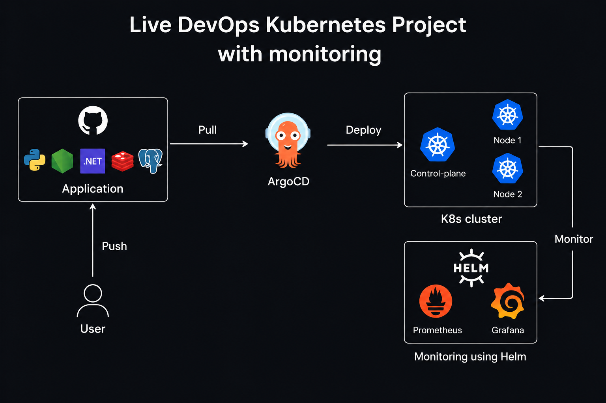

## Overview
This repository provides a comprehensive, end-to-end guide for deploying a microservices-based Voting Application on a local Kubernetes cluster using **Kind**. It demonstrates advanced Kubernetes practices by integrating **ArgoCD** for GitOps deployments, deploying the **Kubernetes Dashboard**, and utilizing the **Kube-Prometheus-Stack** (Prometheus & Grafana) for robust monitoring and metrics visualization.

---

## 1. Creating and Managing Kubernetes Cluster with Kind

First, clear the terminal to start fresh:
```bash
clear
```

Create a 3-node Kubernetes cluster using Kind with your configuration file:
```bash
kind create cluster --config=config.yml
```
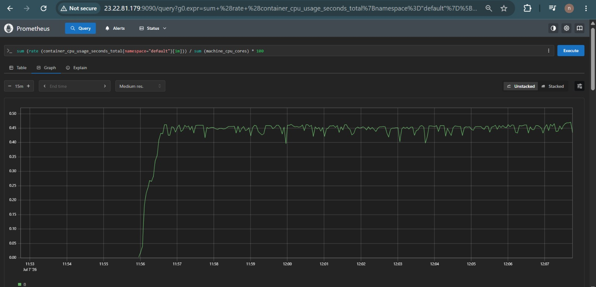
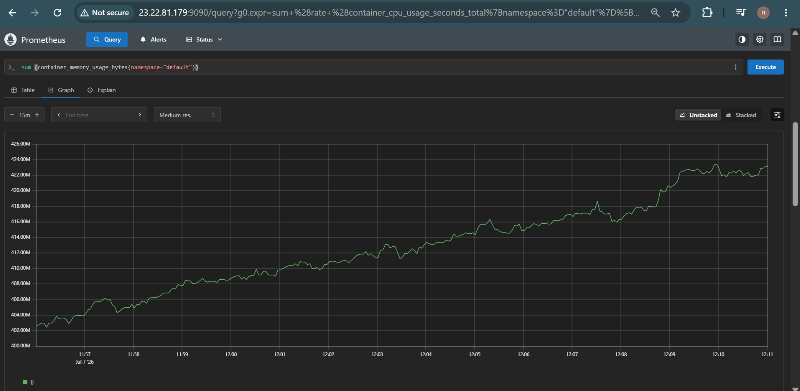

Check the cluster information and verify the nodes are running:
```bash
kubectl cluster-info --context kind-kind
kubectl get nodes
kind get clusters
```
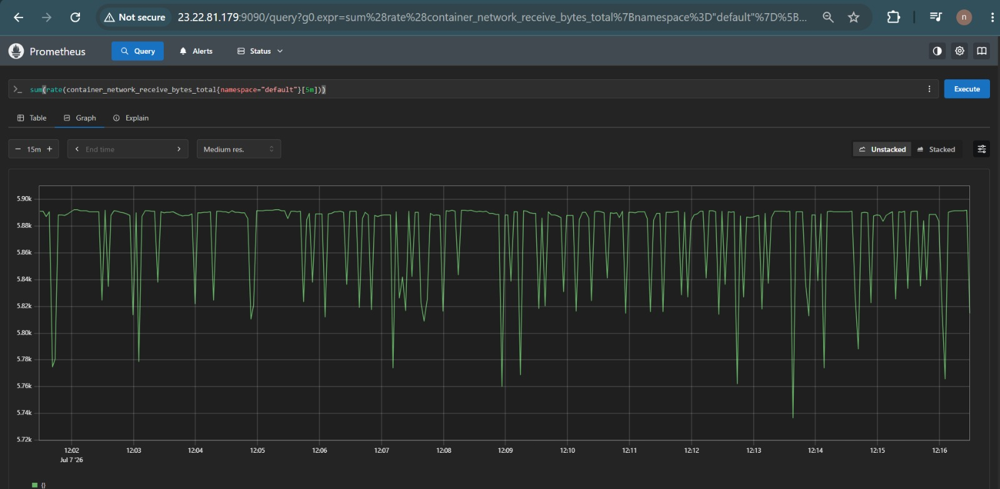
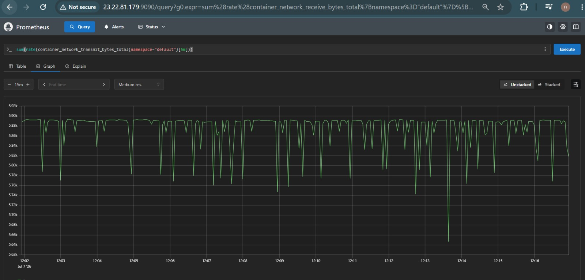

---

## 2. Installing kubectl

If you don't have `kubectl` installed to manage the cluster, download and configure it:
```bash
curl -o kubectl https://amazon-eks.s3.us-west-2.amazonaws.com/1.19.6/2021-01-05/bin/linux/amd64/kubectl
chmod +x ./kubectl
sudo mv ./kubectl /usr/local/bin
kubectl version --short --client
```
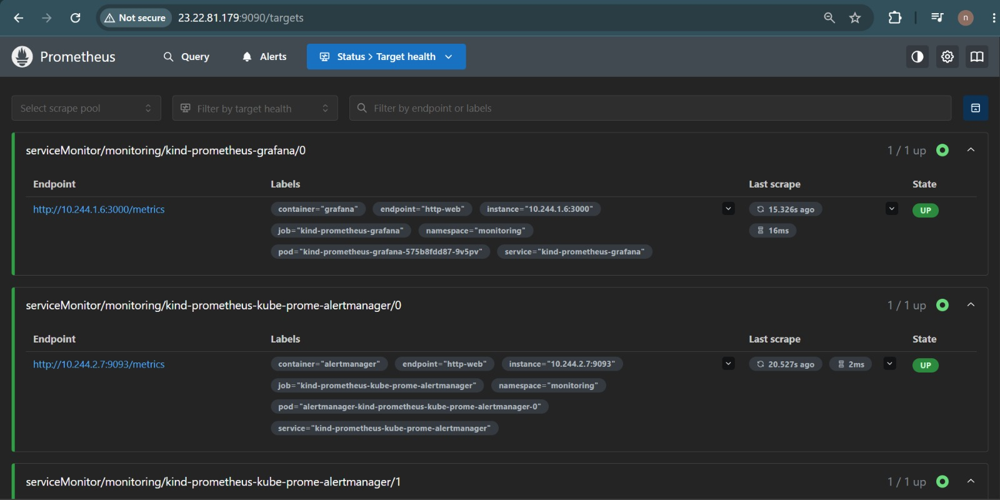

---

## 3. Managing Docker and Kubernetes Pods

Check the Docker containers running (these represent our Kind nodes):
```bash
docker ps
```
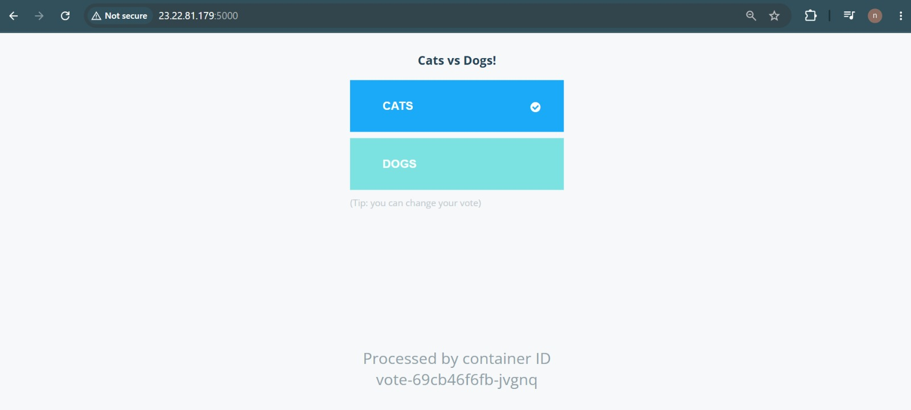

List all Kubernetes pods across all namespaces to ensure core components are running:
```bash
kubectl get pods -A
```
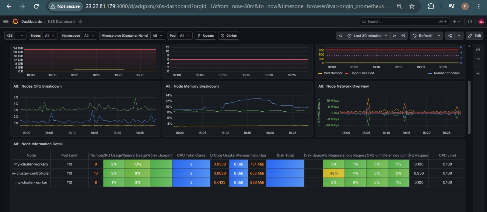 *(Note: Showing pods state after full deployment)*

---

## 4. Cloning and Running the Example Voting App

Clone the official Docker example voting app repository:
```bash
git clone https://github.com/dockersamples/example-voting-app.git
cd example-voting-app/
```
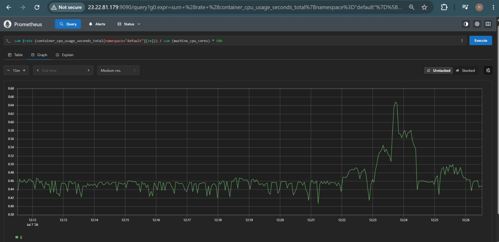
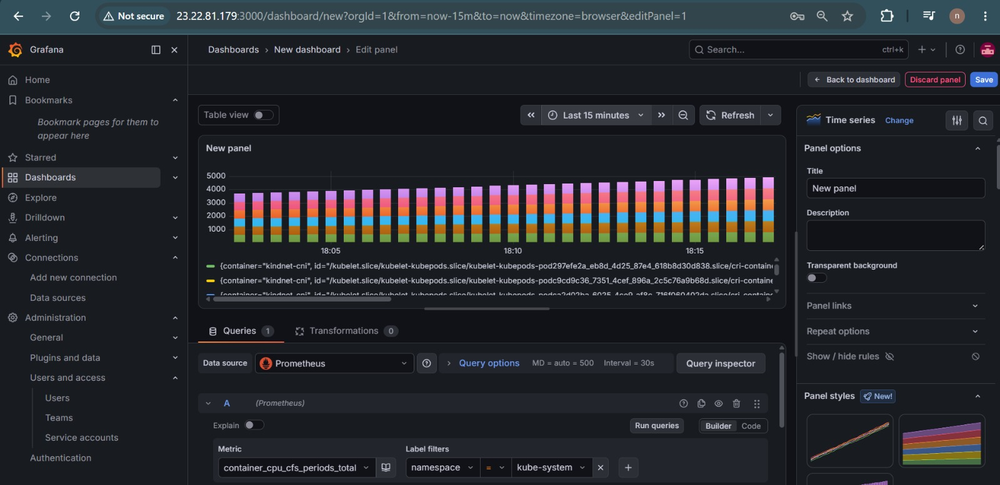

Apply the Kubernetes YAML specifications to deploy the app components:
```bash
kubectl apply -f k8s-specifications/
```
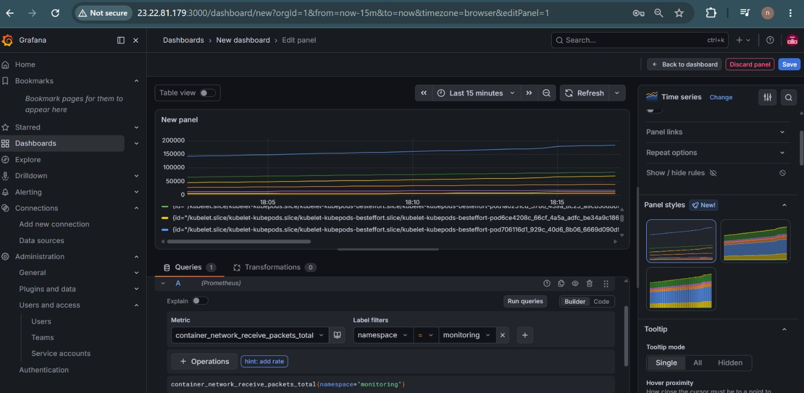
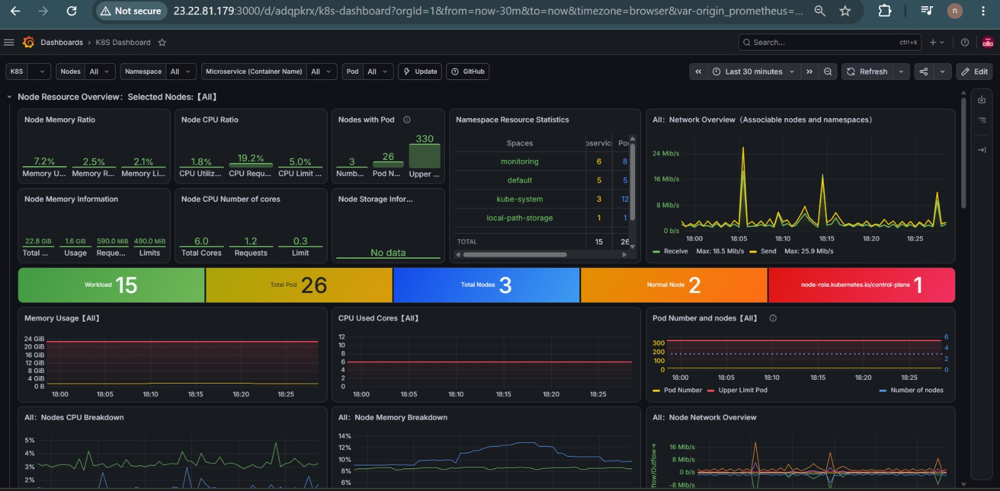

List all created Kubernetes resources:
```bash
kubectl get all
```
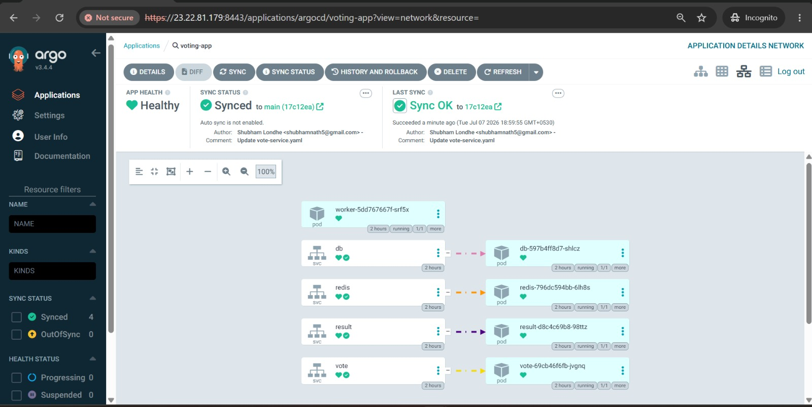

Forward local ports so you can access the Voting and Result web interfaces:
```bash
kubectl port-forward service/vote 5000:5000 --address=0.0.0.0 &
kubectl port-forward service/result 5001:5001 --address=0.0.0.0 &
```
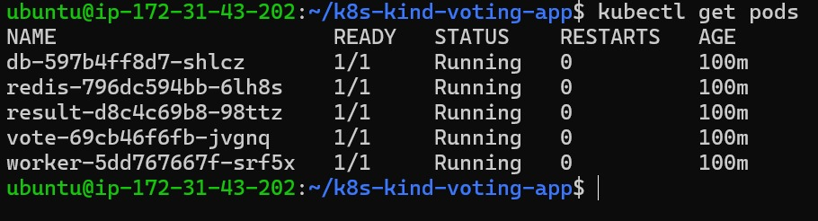
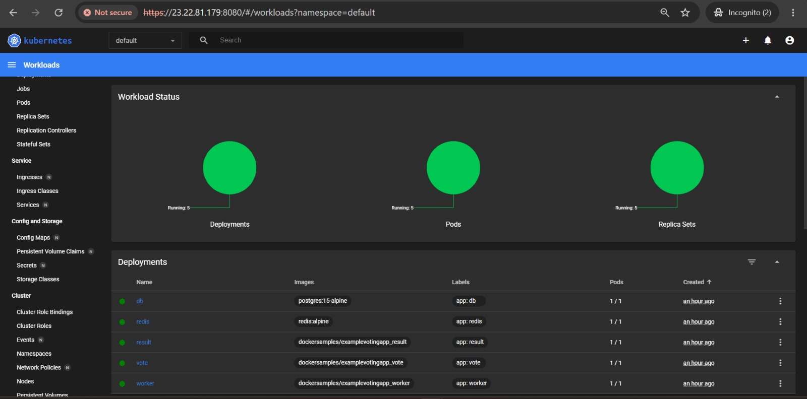

You can now view the app UI on your local browser.
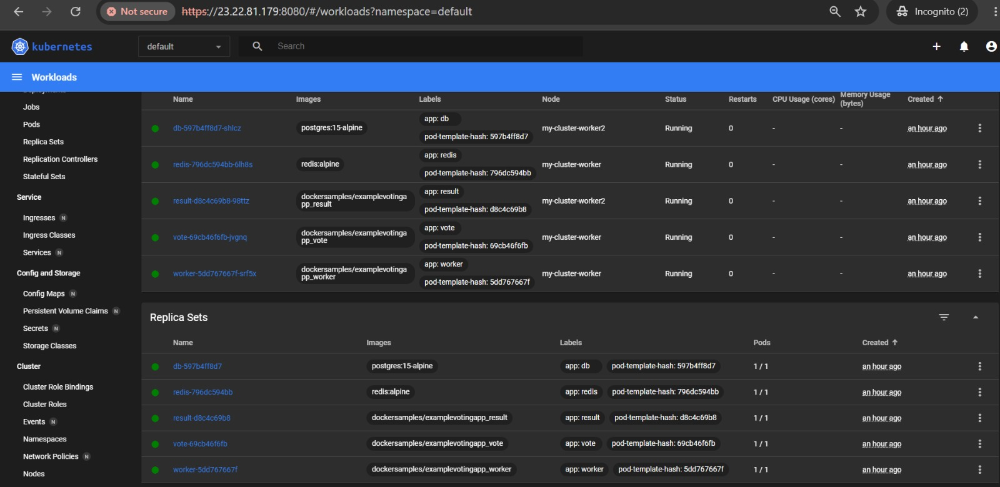

---

## 5. Managing Files in Example Voting App

To explore the source code of the applications:
```bash
cd ..
cd seed-data/
ls
cat Dockerfile
cat generate-votes.sh
```

---

## 6. Installing Argo CD (GitOps)

Create a dedicated namespace for Argo CD:
```bash
kubectl create namespace argocd
```

Apply the official Argo CD installation manifest:
```bash
kubectl apply -n argocd -f https://raw.githubusercontent.com/argoproj/argo-cd/stable/manifests/install.yaml
```

Check that the Argo CD services are up and running:
```bash
kubectl get svc -n argocd
```

Expose the Argo CD server using a NodePort so it can be accessed externally:
```bash
kubectl patch svc argocd-server -n argocd -p '{"spec": {"type": "NodePort"}}'
```

Forward the port to access the Argo CD UI:
```bash
kubectl port-forward -n argocd service/argocd-server 8443:443 &
```

Retrieve the initial admin password to log into the Argo CD UI:
```bash
kubectl get secret -n argocd argocd-initial-admin-secret -o jsonpath="{.data.password}" | base64 -d && echo
```

---

## 7. Installing Kubernetes Dashboard

Deploy the Kubernetes Dashboard for a visual representation of your cluster:
```bash
kubectl apply -f https://raw.githubusercontent.com/kubernetes/dashboard/v2.7.0/aio/deploy/recommended.yaml
```

Create an admin-user token to authenticate and log into the Dashboard:
```bash
kubectl -n kubernetes-dashboard create token admin-user
```

---

## 8. Install HELM

Helm is required to install our monitoring stack. Install Helm using the following script:
```bash
curl -fsSL -o get_helm.sh https://raw.githubusercontent.com/helm/helm/main/scripts/get-helm-3
chmod 700 get_helm.sh
./get_helm.sh
```

---

## 9. Install Kube Prometheus Stack (Monitoring & Grafana)

Add the necessary Helm repositories:
```bash
helm repo add prometheus-community https://prometheus-community.github.io/helm-charts
helm repo add stable https://charts.helm.sh/stable
helm repo update
```

Create a namespace for monitoring and install the Prometheus stack with predefined NodePorts:
```bash
kubectl create namespace monitoring
helm install kind-prometheus prometheus-community/kube-prometheus-stack --namespace monitoring --set prometheus.service.nodePort=30000 --set prometheus.service.type=NodePort --set grafana.service.nodePort=31000 --set grafana.service.type=NodePort --set alertmanager.service.nodePort=32000 --set alertmanager.service.type=NodePort --set prometheus-node-exporter.service.nodePort=32001 --set prometheus-node-exporter.service.type=NodePort
```

Verify the services were created in the monitoring namespace:
```bash
kubectl get svc -n monitoring
kubectl get namespace
```

Port-forward Prometheus and Grafana so you can access their dashboards:
```bash
kubectl port-forward svc/kind-prometheus-kube-prome-prometheus -n monitoring 9090:9090 --address=0.0.0.0 &
kubectl port-forward svc/kind-prometheus-grafana -n monitoring 31000:80 --address=0.0.0.0 &
```

---

## 10. Useful Prometheus Queries

Once Prometheus is running, you can use these PromQL queries to monitor your cluster's health:

**CPU Usage Percentage (Default Namespace):**
```bash
sum (rate (container_cpu_usage_seconds_total{namespace="default"}[1m])) / sum (machine_cpu_cores) * 100
```

**Memory Usage by Pod (Default Namespace):**
```bash
sum (container_memory_usage_bytes{namespace="default"}) by (pod)
```

**Network Traffic by Pod (Default Namespace):**
```bash
sum(rate(container_network_receive_bytes_total{namespace="default"}[5m])) by (pod)
sum(rate(container_network_transmit_bytes_total{namespace="default"}[5m])) by (pod)
```

---

## 11. Cleanup: Deleting Kubernetes Cluster

Once you are done experimenting, you can easily tear down the entire Kind cluster:
```bash
kind delete cluster --name=kind
```
